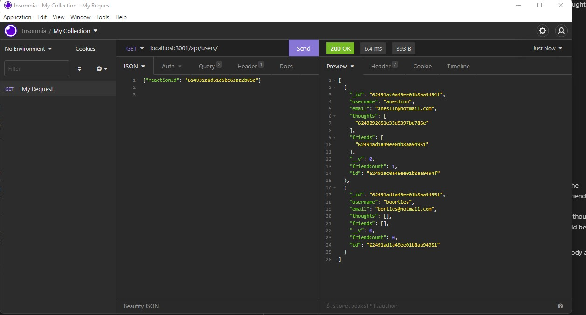

# Social Nework API

Backend program for creating a social network.  A user can create an account with a username and email.  The user can than associate other accounts with theirs as "friends", post short messages called "thoughts" and then react to their thoughts or the thoughts of others.  

## Technology
* MongoDb
* Mongoose
* Expressjs

## Endpoints
* api/user - GET / POST
* api/user/:id  GET / PUT / DELETE 
* api/user/:userId/friends/:friendId POST / DELETE * all params are in url
* api/thoughts GET / POST
* api/thoughts/:id GET / PUT / DELETE
* api/thoughts/:thoughtId/reactions POST / DELETE * reactionId delete is in body

## Usage
To create a new user, post to api/user with a valid username and email address.  Add friends using the api/:userid/friends/:FriendId endpoint.  The friend id in the url parameter will be added to the user friend array.  
Once the user has been created, the user can post short messages to the api/thoughts endpoint.  A thought must include a thought text, as well as a userId to associate it with the correct user.  username should be included as well. 

Users may react to thoughts through the api/thoughts/:thoughtId/reactions endpoint.  A reaction body and username must be supplied.

## Screenshot

## Video demo
[video demonstration](https://drive.google.com/file/d/1ojZe2o-b8dDBVeFruHyppETEKrAhw86n/view)
